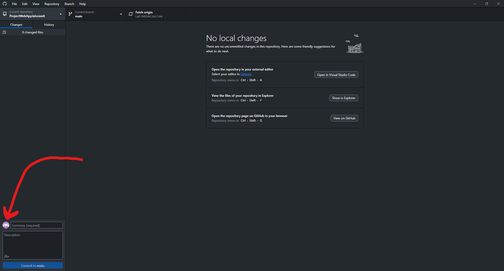
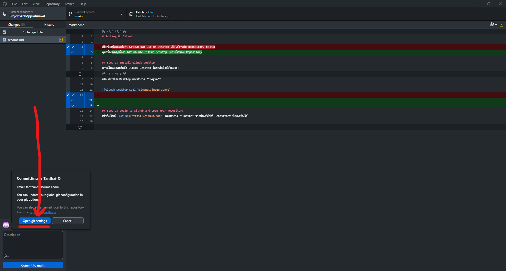
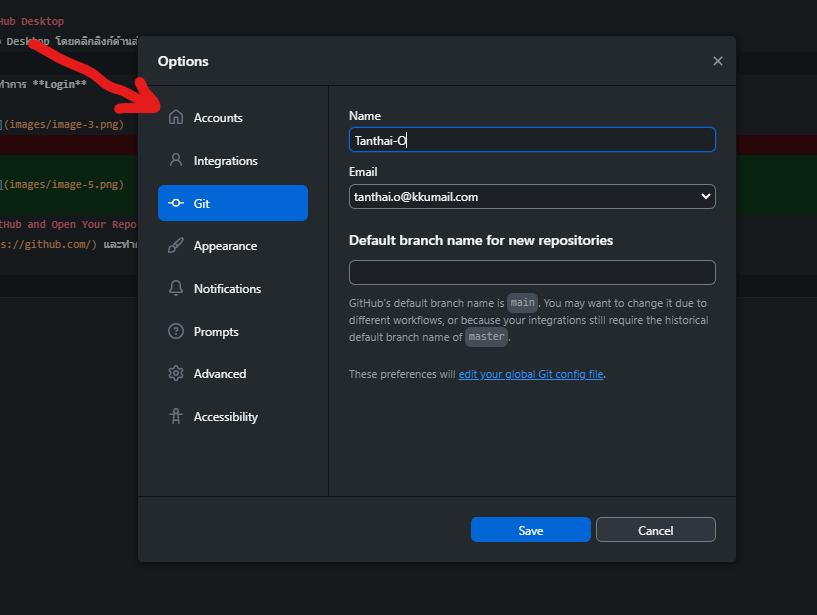
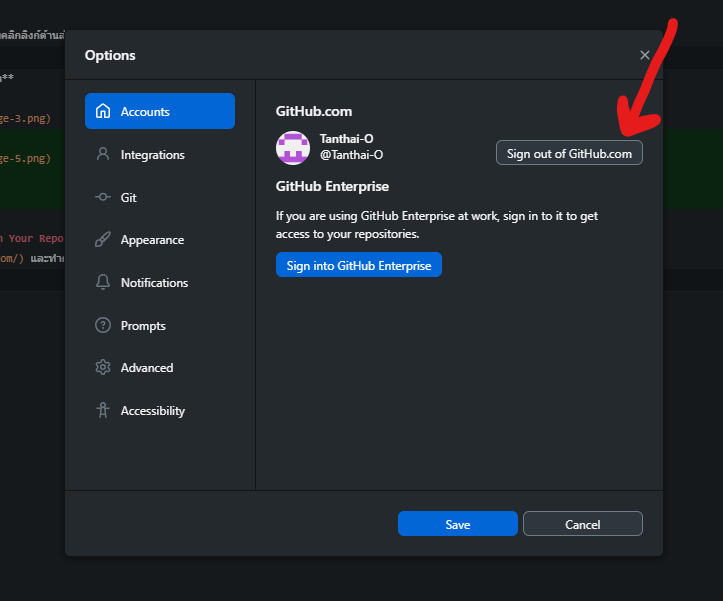
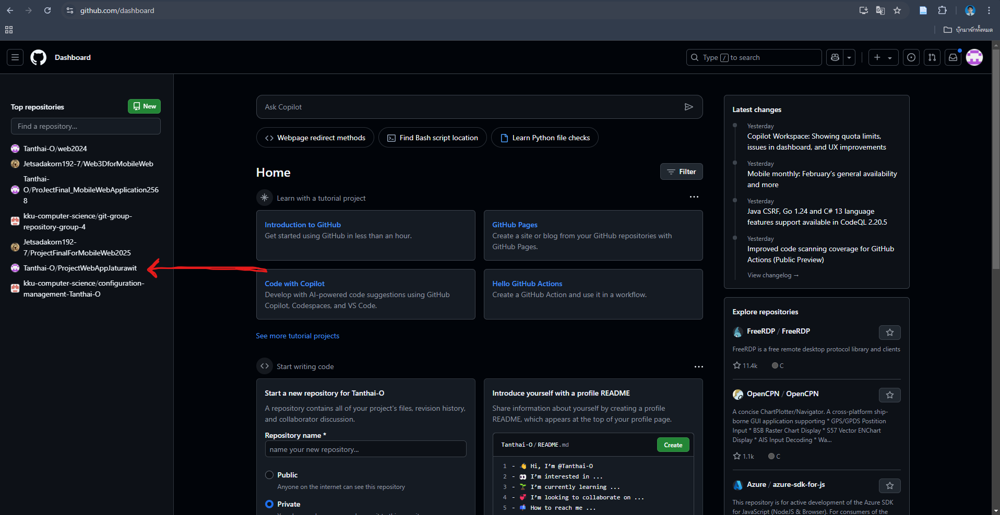
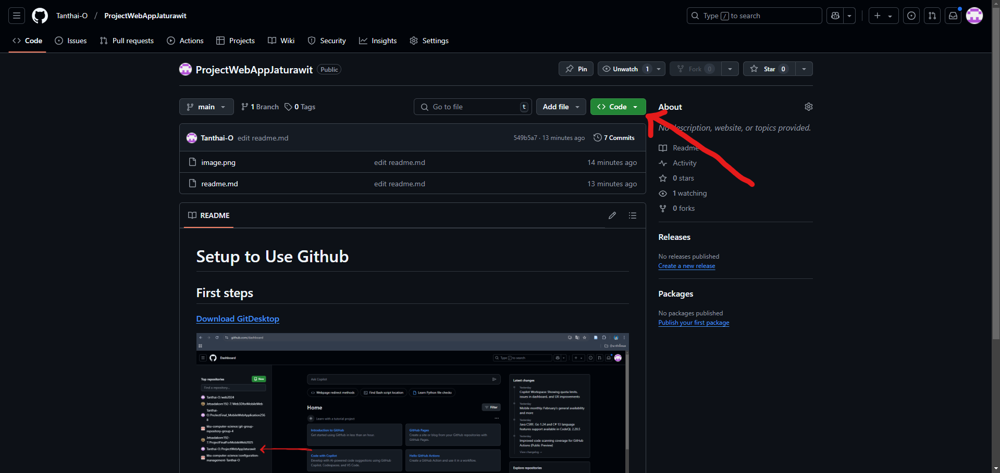
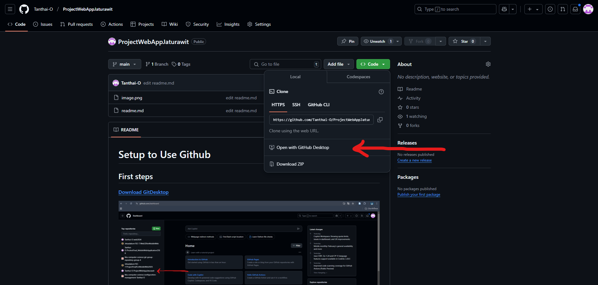

# Setting Up GitHub

คู่มือนี้จะพีคคุงตั้งค่า GitHub และ GitHub Desktop เพื่อใช้งานกับ Repository

## Step 1: Install GitHub Desktop
ดาวน์โหลดและติดตั้ง GitHub Desktop โดยคลิกลิงก์ด้านล่าง:  
👉 **[Download GitHub Desktop](https://desktop.github.com/download/)**  

เปิด GitHub Desktop และทำการ **Login**  

หลังจากเปิด GitHub Desktop จะเห็นหน้าจอต้อนรับ:  
 

คลิก **Sign in to GitHub.com**  
 

เข้าสู่ระบบด้วยบัญชี GitHub ของคุณ 
  

เมื่อเข้าสู่ระบบสำเร็จ คุณจะเห็นหน้าจอหลักของ GitHub Desktop  
 

---

## Step 2: Access Your Repository on GitHub
 
เข้าเว็บไซต์ [GitHub](https://github.com/) และทำการ **Login** จากนั้นเข้าไปที่ Repository ที่คุณสร้างไว้  

ไปที่หน้า Dashboard และเลือก Repository ของคุณ  
 

คลิกที่ Repository ที่ต้องการใช้งาน  
 

เมื่อเข้า Repository แล้ว จะเห็นหน้าหลักดังภาพ  
 

---

## Step 3: Clone Your Repository  
หลังจากเข้า Repository แล้ว ให้คลิก **Code** > **Open with GitHub Desktop**  

---

## 🎯 สรุป  
- ✅ ติดตั้งและล็อกอิน **GitHub Desktop**  
- ✅ เข้า **GitHub** และเลือก Repository  
- ✅ พร้อม Clone Repository เพื่อเริ่มใช้งาน  

**แค่นี้ก็พร้อมใช้งานแล้ว! 🚀**